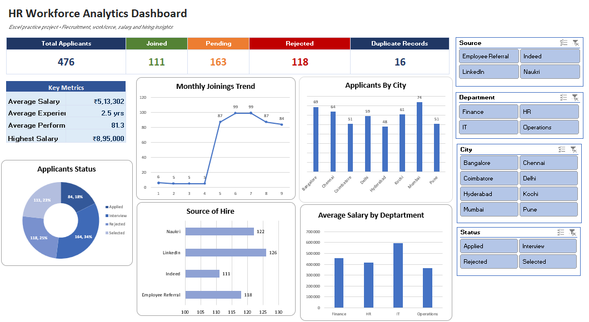

# 📊 Excel Data Analytics

A collection of Excel-based data analytics practice projects and interactive dashboards focused on data cleaning, data analysis, visualization, and business insights.

This repository documents my hands-on practice with Microsoft Excel and progressively more interactive analytics workflows.

---

## 📁 Projects

### 1. HR Workforce Analytics Dashboard

An interactive HR analytics dashboard developed in Microsoft Excel to analyze recruitment and workforce data.

### 📸 Dashboard Preview

*Click the image to view the dashboard image.*

---

### 🔍 Dashboard Overview

The dashboard provides an overview of recruitment and workforce-related metrics, including:

- Total Applicants
- Joined Employees
- Pending Applications
- Rejected Applications
- Duplicate Records
- Average Salary
- Average Experience
- Average Performance
- Highest Salary
- Monthly Joining Trends
- Applicants by City
- Source of Hire
- Average Salary by Department
- Applicant Status Distribution

### 🎛️ Interactive Features

The dashboard includes interactive Excel slicers for:

- **City**
- **Department**
- **Status**
- **Source of Hire**

These slicers allow the user to dynamically filter the dashboard and explore different segments of the workforce data.

---

## 🛠️ Excel Skills Demonstrated

- Data Cleaning
- Data Validation
- Excel Tables
- Excel Formulas
- Conditional Formatting
- PivotTables
- PivotCharts
- Interactive Slicers
- KPI Development
- Data Analysis
- Data Visualization
- Dashboard Design

---

## 📊 Analysis Areas

The projects in this repository focus on transforming raw data into useful insights through:

**Raw Data → Data Cleaning → Analysis → PivotTables → Visualization → Interactive Dashboard**

The HR dashboard specifically explores recruitment status, hiring sources, geographical distribution, salary patterns, and joining trends.

---

## 📂 Project Files

### HR Workforce Analytics

- [📊 Excel Workbook](./HR-Workforce-Analytics/HR_Workforce_Analytics_Dashboard.xlsx)
- [🖼️ Dashboard Preview](./HR-Workforce-Analytics/Dashboard.png)

The Excel workbook contains the underlying data, analysis, PivotTables, PivotCharts, and interactive dashboard.

---

## 🎯 Purpose of This Repository

This repository is a collection of my Excel data analytics practice and portfolio projects.

The goal is to strengthen practical skills in:

- Data preparation
- Exploratory analysis
- Business-oriented reporting
- Data visualization
- Dashboard development
- Interactive Excel analytics

More Excel practice projects and dashboards will be added to this repository over time.

---

## 🚀 Future Projects

Planned additions may include dashboards and analysis projects related to:

- Sales Analytics
- Financial Analytics
- E-commerce Analytics
- HR Analytics
- Business Performance
- Data Cleaning Practice
- Advanced Excel Analysis

---

## 👩‍💻 About Me

**Anusha C**

B.Tech Information Technology Graduate

Interested in opportunities related to:

- Data Analytics
- Data Science
- Machine Learning
- AI/ML

---

⭐ This repository will be continuously updated as I build and practice more Excel analytics projects.
